# Architecture Diagrams

**Last Updated**: October 16, 2025  
**Diagram Format**: Mermaid.js  

---

## System Context (C4 Model - Level 1)

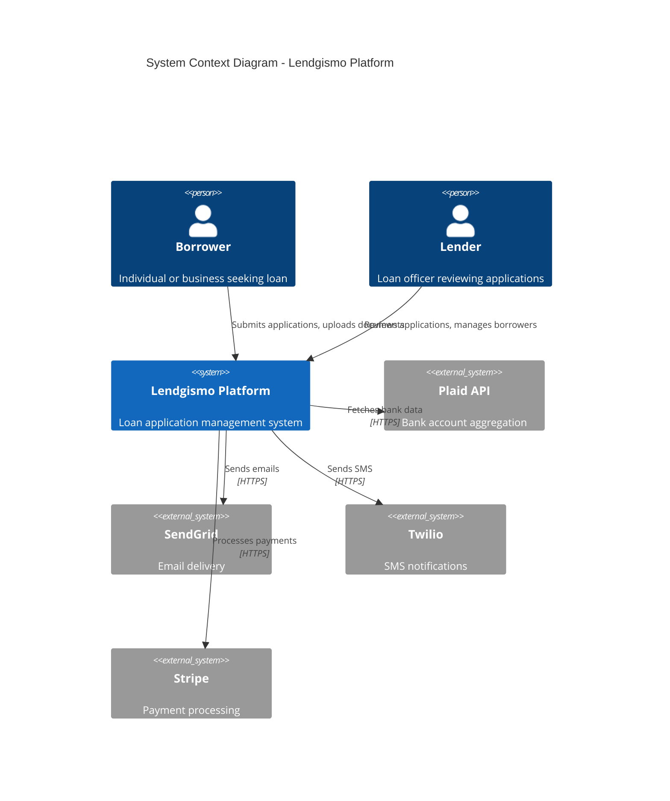

---

## Container Diagram (C4 Model - Level 2)

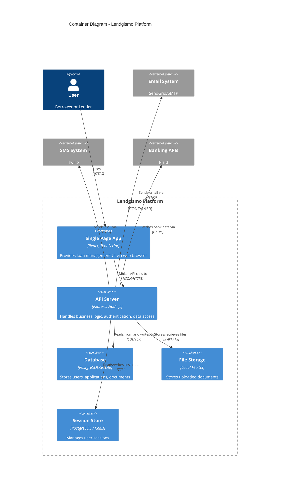

---

## Component Diagram - API Server

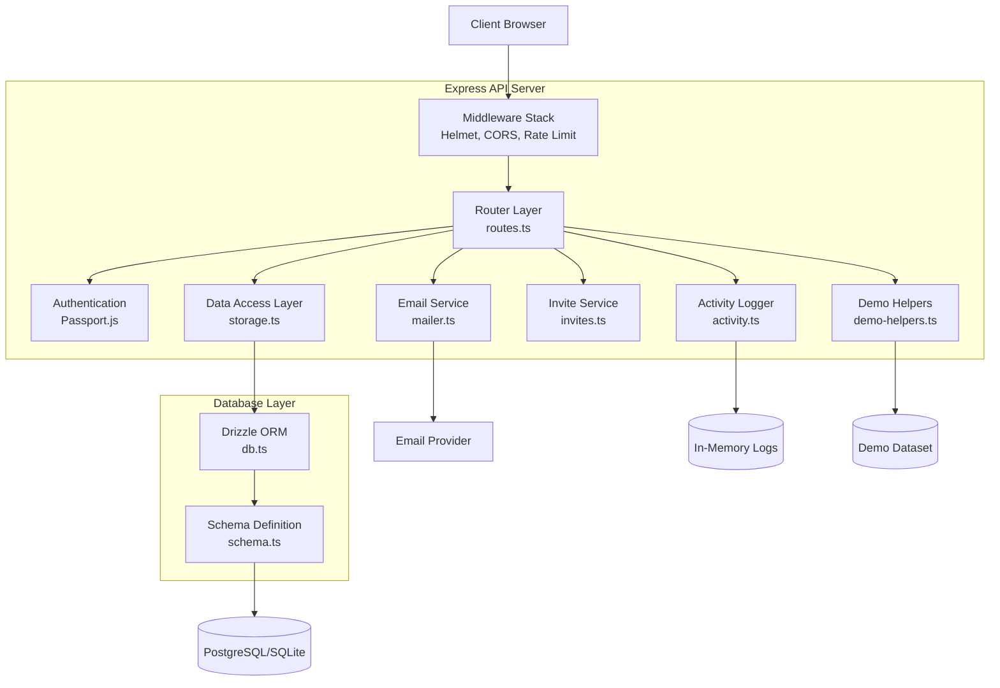

---

## Sequence Diagram - User Login

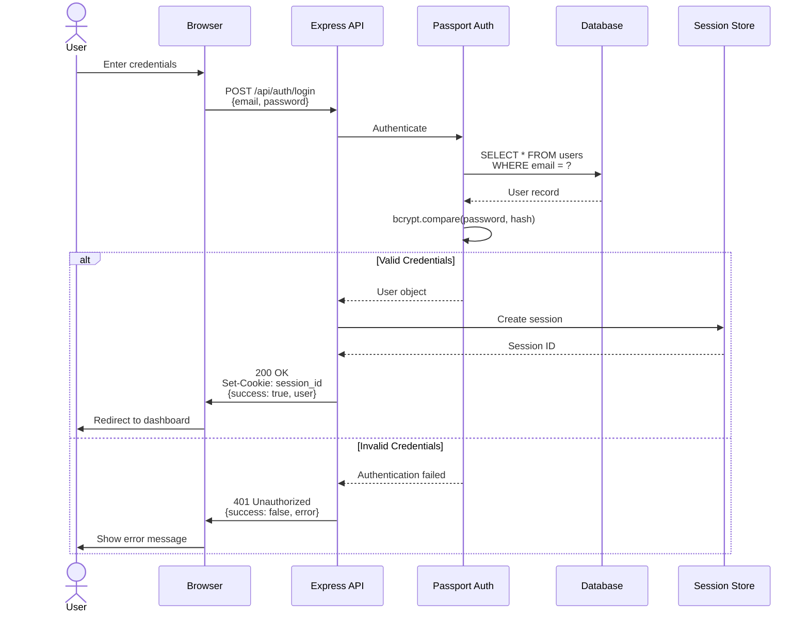

---

## Sequence Diagram - Loan Application Workflow

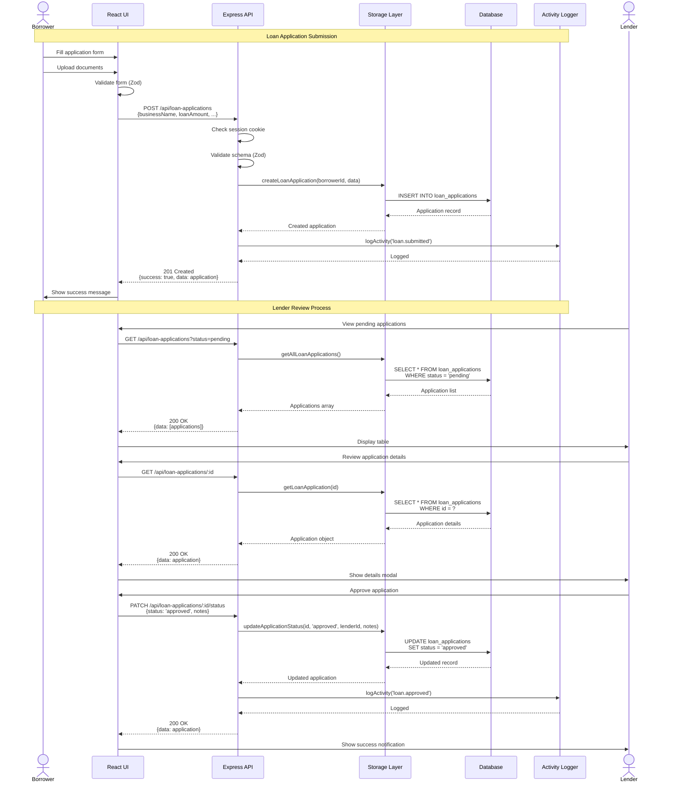

---

## Deployment Diagram - Local Development

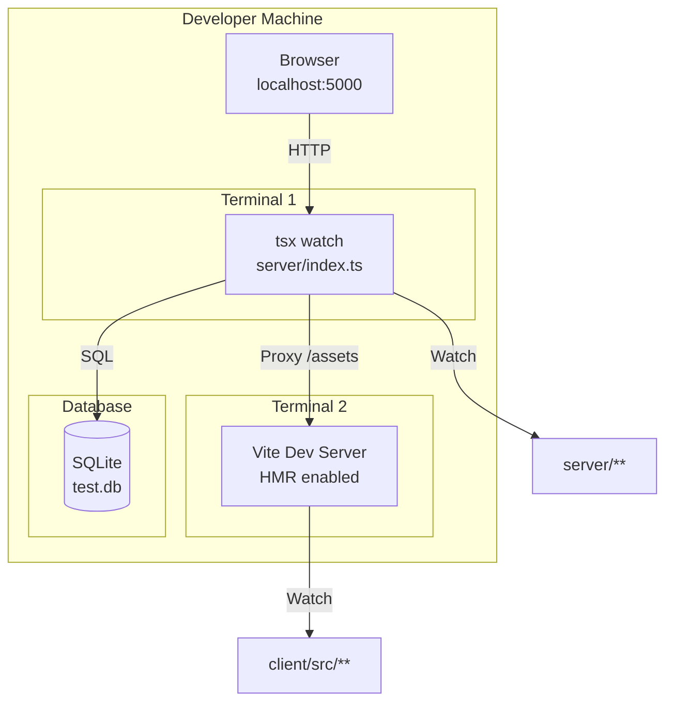

---

## Deployment Diagram - Production (Heroku/Azure)

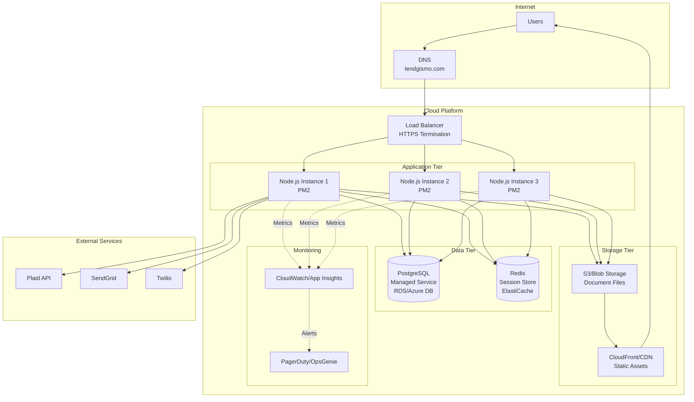

---

## Data Flow Diagram - Document Upload

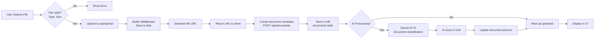

---

## State Machine - Loan Application Status

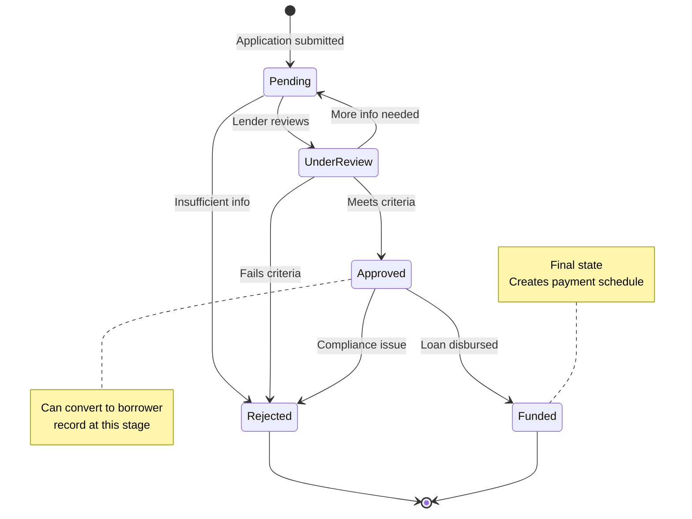

---

## Network Architecture - Security Layers

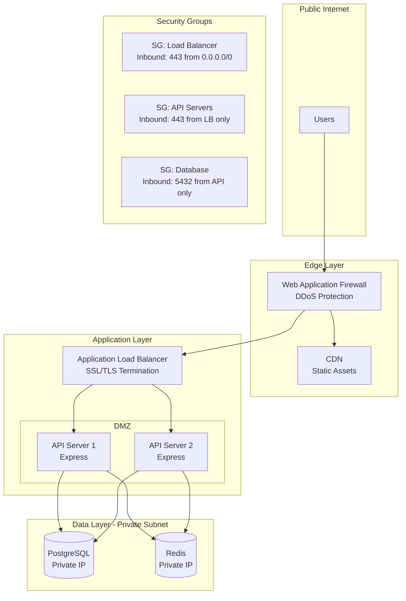

---

## CI/CD Pipeline

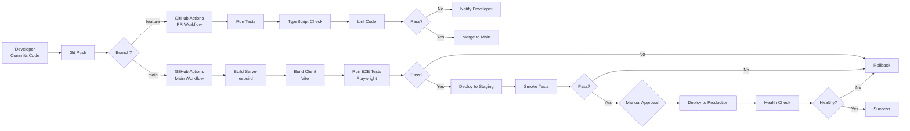

---

## Caching Strategy

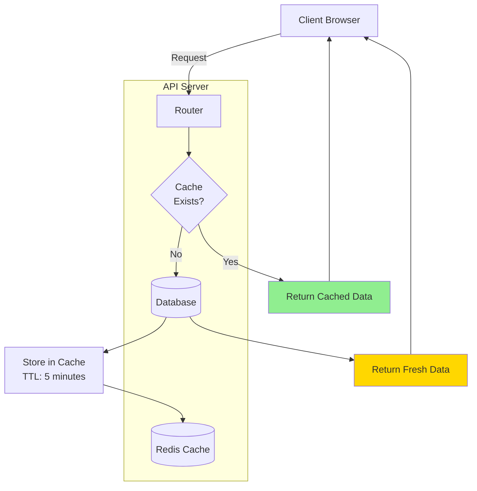

---

## Rendering Instructions

All diagrams use **Mermaid.js** syntax and can be rendered in:

1. **GitHub/GitLab**: Native Mermaid support in Markdown
2. **VS Code**: Install "Markdown Preview Mermaid Support" extension
3. **Docusaurus**: Built-in Mermaid plugin
4. **Static Export**: Use Mermaid CLI
   ```bash
   npx @mermaid-js/mermaid-cli -i diagram.mmd -o diagram.svg
   ```

---

**End of Architecture Diagrams**  
*See also*: `10_architecture.md` for detailed descriptions, `12_rbac-matrix.md` for access control
