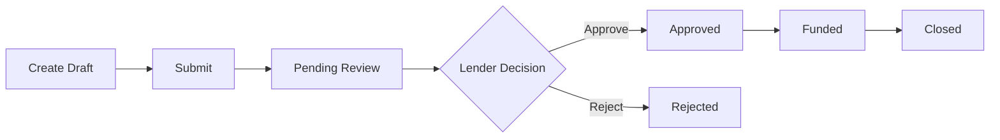

# Features Overview

**Last Updated**: October 16, 2025  
**Platform Version**: v1.0.0

## At a glance
- Audience: Product + Engineering leads
- Scope: What exists now and what’s planned
- Related: `41_ui-map.md`, `42_theming.md`, `43_accessibility.md`

## Quick links
- [Core Features](#core-features)
- [Feature Flags](#feature-flags)
- [Planned Features](#planned-features)
- [Feature Comparison Matrix](#feature-comparison-matrix)
- [Technical Implementation](#technical-implementation)
- [API Endpoints Summary](#api-endpoints-summary)
- [Security Features](#security-features)
- [Performance Optimizations](#performance-optimizations)
- [Accessibility](#accessibility)

---

## Feature Summary

Lendgismo is a comprehensive loan management platform designed for lenders and borrowers. This document provides an overview of all features, their implementation status, and technical details.

---

## Core Features

### 1. Authentication & Authorization

**Status**: ✅ **Production Ready**

**Description**: Secure session-based authentication with role-based access control.

**Features**:
- Email/password login
- Session management (express-session + SQLite/PostgreSQL store)
- Role-based access control (RBAC) - Lender vs. Borrower
- Demo mode for testing
- Secure password hashing (bcrypt)

**Endpoints**:
- `POST /api/login` - User login
- `POST /api/logout` - User logout
- `GET /api/user` - Get current user
- `POST /api/register` - User registration (borrowers)

**Files**:
- `server/routes.ts` - Authentication routes
- `server/middleware.ts` - Auth middleware
- `client/src/components/auth/LoginForm.tsx` - Login UI
- `client/src/lib/auth.ts` - Client-side auth utilities

**Access Control**:
- **Lenders**: Full access to all applications, borrowers, settings
- **Borrowers**: Access only to own applications and profile

---

### 2. Loan Application Management

**Status**: ✅ **Production Ready**

**Description**: End-to-end loan application lifecycle management.

**Features**:
- Create new loan applications
- Submit applications for review
- Lender approval workflow
- Application status tracking
- Document attachments
- Comments and notes
- Application history/audit trail

**Application Statuses**:
1. `draft` - Created but not submitted
2. `pending` - Submitted, awaiting review
3. `under_review` - Lender is reviewing
4. `approved` - Application approved
5. `rejected` - Application rejected
6. `funded` - Loan has been funded
7. `closed` - Loan closed (paid off or defaulted)

**Endpoints**:
- `GET /api/loan-applications` - List applications (filtered by role)
- `POST /api/loan-applications` - Create new application
- `GET /api/loan-applications/:id` - Get application details
- `PATCH /api/loan-applications/:id` - Update application
- `PATCH /api/loan-applications/:id/status` - Change status
- `DELETE /api/loan-applications/:id` - Delete application (soft delete)

**Files**:
- `shared/schema.ts` - Database schema (loanApplications table)
- `server/routes.ts` - Application CRUD routes
- `client/src/components/LoanApplicationForm.tsx` - Application form
- `client/src/components/applications/ApplicationDetailPage.tsx` - Detail view

**Workflow**:


---

### 3. Document Management

**Status**: ✅ **Production Ready**

**Description**: Upload, store, and manage documents attached to loan applications.

**Features**:
- File upload (PDFs, images, Word docs)
- Document categorization (financial statements, tax returns, business plans, etc.)
- File size limits (10 MB default)
- Secure file storage (local filesystem or cloud storage)
- Document preview/download
- Document versioning

**Supported File Types**:
- PDF (`.pdf`)
- Images (`.jpg`, `.jpeg`, `.png`, `.gif`)
- Documents (`.doc`, `.docx`, `.xls`, `.xlsx`)

**Endpoints**:
- `POST /api/documents` - Upload document
- `GET /api/documents/:id` - Download document
- `GET /api/loan-applications/:id/documents` - List documents for application
- `DELETE /api/documents/:id` - Delete document

**Files**:
- `server/storage.ts` - File upload handling
- `shared/schema.ts` - Documents table schema
- `client/src/components/DocumentUpload.tsx` - Upload UI
- `client/src/components/DocumentsTab.tsx` - Document list view

**Storage**:
- **Local**: `./uploads/` directory (development)
- **Cloud**: AWS S3, Azure Blob Storage, or GCS (production recommended)

---

### 4. Bank Account Integration

**Status**: ✅ **Implemented** (via Plaid)

**Description**: Connect borrower bank accounts for financial verification.

**Features**:
- Plaid Link integration
- Account verification
- Transaction history
- Balance checking
- Multiple accounts per borrower

**Plaid Integration**:
- **Environment**: `sandbox` (dev), `development` (staging), `production` (prod)
- **Products**: `auth`, `transactions`, `identity`

**Endpoints**:
- `POST /api/plaid/link-token` - Create Plaid Link token
- `POST /api/plaid/exchange-token` - Exchange public token for access token
- `GET /api/plaid/accounts/:id` - Get account details
- `GET /api/plaid/transactions/:id` - Get account transactions

**Files**:
- `server/integrations.ts` - Plaid integration
- `client/src/components/AccountConnection.tsx` - Plaid Link UI
- `shared/schema.ts` - bankAccounts table

**Configuration**:
```bash
PLAID_CLIENT_ID=your_client_id
PLAID_SECRET=your_secret
PLAID_ENV=sandbox  # or development, production
```

---

### 5. Borrower Invitation System

**Status**: ✅ **Production Ready**

**Description**: Lenders can invite borrowers to create accounts via email.

**Features**:
- Generate unique invite links
- Email invitations (SendGrid)
- Invite expiration (30 days default)
- Invite tracking (sent, accepted, expired)
- Secure HMAC-signed tokens

**Endpoints**:
- `POST /api/invites/generate` - Generate invite link
- `POST /api/invites/accept` - Accept invite and create account
- `GET /api/invites` - List all invites (lenders only)
- `DELETE /api/invites/:id` - Revoke invite

**Files**:
- `server/lib/invites.ts` - Invite generation and validation
- `server/lib/mailer.ts` - Email sending
- `client/src/pages/AcceptInvitePage.tsx` - Invite acceptance UI

**Invite Flow**:
1. Lender enters borrower email
2. System generates unique invite link
3. Email sent to borrower
4. Borrower clicks link, creates account
5. Invite marked as accepted

**Invite Link Format**:
```
https://app.lendgismo.com/invite/accept?token=<HMAC_SIGNED_TOKEN>
```

---

### 6. Dashboard & Analytics

**Status**: ✅ **Production Ready**

**Description**: Role-specific dashboards with key metrics and visualizations.

**Lender Dashboard**:
- Total applications (all time, this month, this week)
- Application status breakdown (pie chart)
- Recent applications table
- Pending approvals count
- Funded loans total
- Portfolio overview

**Borrower Dashboard**:
- My applications summary
- Application status
- Recent activity
- Required actions
- Document checklist

**Endpoints**:
- `GET /api/dashboard/stats` - Dashboard statistics
- `GET /api/dashboard/recent` - Recent activity
- `GET /api/dashboard/alerts` - Alerts and notifications

**Files**:
- `client/src/components/LenderDashboard.tsx` - Lender dashboard
- `client/src/components/BorrowerDashboard.tsx` - Borrower dashboard
- `client/src/components/DashboardStatCard.tsx` - Stat card component

**Visualizations**:
- Sparklines (trend lines)
- Pie charts (status distribution)
- Bar charts (monthly volume)
- Tables (recent applications)

---

### 7. Borrower Management

**Status**: ✅ **Production Ready**

**Description**: Lenders can view, search, and manage all borrowers.

**Features**:
- Borrower list with search/filter
- Borrower profile view
- Application history per borrower
- Contact information
- Account status (active, suspended)
- Notes and tags

**Endpoints**:
- `GET /api/borrowers` - List all borrowers (lenders only)
- `GET /api/borrowers/:id` - Get borrower details
- `PATCH /api/borrowers/:id` - Update borrower info
- `GET /api/borrowers/:id/applications` - Get borrower's applications

**Files**:
- `client/src/components/borrowers/BorrowersListPage.tsx` - Borrower list
- `client/src/components/borrowers/BorrowerDetailPage.tsx` - Borrower profile

**Filters**:
- Search by name, email
- Filter by status (active, suspended)
- Sort by creation date, name, email

---

### 8. Account Settings

**Status**: ✅ **Production Ready**

**Description**: User account and profile management.

**Features**:
- Profile editing (name, email, phone)
- Password change
- Email preferences
- Notification settings
- Two-factor authentication (future)

**Endpoints**:
- `GET /api/account-settings` - Get user settings
- `PATCH /api/account-settings` - Update settings
- `POST /api/account/change-password` - Change password

**Files**:
- `shared/schema.ts` - accountSettings table
- `client/src/pages/AccountSettingsPage.tsx` - Settings UI

**Settings**:
- `emailNotifications` (boolean)
- `smsNotifications` (boolean)
- `twoFactorEnabled` (boolean, future)
- `language` (string, future)
- `timezone` (string, future)

---

### 9. Branding & Customization

**Status**: ✅ **Production Ready** (Lenders only)

**Description**: Lenders can customize the platform's appearance and branding.

**Features**:
- Company name
- Logo upload
- Color scheme (primary, secondary, accent)
- Font selection
- Custom domain (future)

**Endpoints**:
- `GET /api/branding` - Get branding settings
- `PATCH /api/branding` - Update branding
- `POST /api/branding/logo` - Upload logo

**Files**:
- `shared/schema.ts` - brandingSettings table
- `client/src/components/account/BrandingSettingsPage.tsx` - Branding UI

**Customizable Elements**:
- Logo (header, footer)
- Primary color (buttons, links)
- Secondary color (backgrounds)
- Accent color (highlights)
- Font family (headings, body text)

---

### 10. Activity Logging

**Status**: ✅ **Production Ready**

**Description**: Comprehensive audit trail for all user actions.

**Features**:
- Action logging (login, logout, create, update, delete)
- User tracking (who did what, when)
- IP address logging
- Searchable activity log
- Export to CSV

**Endpoints**:
- `GET /api/activity` - Get activity log (lenders only)
- `GET /api/activity/:userId` - Get activity for specific user

**Files**:
- `server/activity.ts` - Activity logging utilities
- `shared/schema.ts` - activityLog table
- `client/src/pages/ActivityLogPage.tsx` - Activity log UI

**Logged Actions**:
- `user.login`
- `user.logout`
- `user.register`
- `application.create`
- `application.submit`
- `application.approve`
- `application.reject`
- `document.upload`
- `document.delete`
- `settings.update`

---

## Feature Flags

### Current Flags

```typescript
export const featureFlags = {
  // Stable features
  LOAN_APPLICATIONS: true,
  DOCUMENT_UPLOAD: true,
  BORROWER_INVITES: true,
  ACTIVITY_LOG: true,
  ACCOUNT_SETTINGS: true,
  BRANDING: true,
  
  // Third-party integrations
  PLAID_ENABLED: !!process.env.PLAID_CLIENT_ID,
  STRIPE_ENABLED: !!process.env.STRIPE_SECRET,
  TWILIO_ENABLED: !!process.env.TWILIO_SID,
  
  // Beta features
  AI_RISK_SCORING: process.env.ENABLE_AI_SCORING === '1',
  REAL_TIME_NOTIFICATIONS: process.env.ENABLE_WEBSOCKET === '1',
  ADVANCED_ANALYTICS: process.env.ENABLE_ANALYTICS === '1',
  
  // Future features
  MULTI_CURRENCY: false,
  BLOCKCHAIN_VERIFICATION: false,
  MOBILE_APP: false,
}
```

---

## Planned Features

### Q1 2025

1. **Advanced Risk Scoring**
   - AI-powered creditworthiness analysis
   - Machine learning models for default prediction
   - Risk score dashboard

2. **Real-Time Notifications**
   - WebSocket-based live updates
   - Push notifications (web + mobile)
   - Email digests

3. **Advanced Analytics**
   - Custom reports
   - Export to Excel/PDF
   - Scheduled report generation

### Q2 2025

4. **Mobile Application**
   - React Native iOS/Android apps
   - Mobile-optimized UI
   - Offline support

5. **Multi-Tenancy**
   - Multiple lender organizations
   - Tenant isolation
   - Subdomain routing

6. **Payment Processing**
   - Stripe integration
   - ACH payments
   - Loan repayment tracking

### Q3 2025

7. **Multi-Currency Support**
   - USD, EUR, GBP support
   - Exchange rate tracking
   - Currency conversion

8. **Advanced Document Processing**
   - OCR (Optical Character Recognition)
   - Automatic data extraction
   - Document classification

9. **Blockchain Verification**
   - Immutable audit trail on blockchain
   - Smart contract loan agreements
   - Cryptocurrency loan disbursement

---

## Feature Comparison Matrix

| Feature | Lender | Borrower | Admin |
|---------|--------|----------|-------|
| View all applications | ✅ | ❌ (own only) | ✅ |
| Approve/reject applications | ✅ | ❌ | ✅ |
| Create applications | ❌ | ✅ | ✅ |
| Upload documents | ✅ | ✅ | ✅ |
| Manage borrowers | ✅ | ❌ | ✅ |
| Send invites | ✅ | ❌ | ✅ |
| View activity log | ✅ | ❌ (own only) | ✅ |
| Customize branding | ✅ | ❌ | ✅ |
| Connect bank accounts | ❌ | ✅ | ✅ |
| View analytics | ✅ | ❌ (basic only) | ✅ |

---

## Technical Implementation

### Frontend Stack

- Framework: React 18 + TypeScript
- Routing: Wouter
- State: React Query (TanStack Query)
- UI: Radix UI + Tailwind CSS + shadcn/ui
- Forms: React Hook Form + Zod validation
- Charts: Recharts
- HTTP: native fetch

### Backend Stack

- **Runtime**: Node.js 20+
- **Framework**: Express.js 4
- **ORM**: Drizzle ORM 0.39
- **Database**: SQLite (dev), PostgreSQL (prod)
- **Authentication**: express-session + bcrypt
- **Validation**: Zod
- **Email**: SendGrid
- **File Upload**: Multer

### Database Schema

See `20_data-model.md` for full schema documentation.

**Key Tables**:
- `users` - User accounts
- `loanApplications` - Loan applications
- `documents` - Uploaded documents
- `bankAccounts` - Connected bank accounts
- `applicationInvites` - Borrower invites
- `accountSettings` - User preferences
- `brandingSettings` - Branding customization
- `activityLog` - Audit trail

---

## API Endpoints Summary

See `openapi/openapi.yaml` for full API specification.

**Total Endpoints**: 30+

**By Category**:
- Authentication: 4 endpoints
- Loan Applications: 8 endpoints
- Documents: 5 endpoints
- Borrowers: 6 endpoints
- Invites: 4 endpoints
- Account Settings: 3 endpoints
- Branding: 3 endpoints
- Activity Log: 2 endpoints
- Plaid Integration: 5 endpoints
- Dashboard: 3 endpoints

---

## Security Features

1. **Authentication**
   - Session-based (express-session)
   - Secure cookies (httpOnly, sameSite, secure)
   - Password hashing (bcrypt, cost factor 10)

2. **Authorization**
   - Role-based access control (RBAC)
   - Resource-level permissions
   - Ownership checks

3. **Input Validation**
   - Zod schema validation
   - SQL injection prevention (parameterized queries)
   - XSS protection (input sanitization)

4. **Rate Limiting**
   - 100 requests per 15 minutes (default)
   - Configurable per endpoint

5. **CSRF Protection**
   - SameSite cookies
   - CSRF tokens (future)

6. **HTTPS**
   - Enforced in production
   - HSTS headers

7. **Content Security Policy**
   - Restrictive CSP headers
   - Script/style nonces

---

## Performance Optimizations

1. **Database**
   - Indexed columns (userId, applicationId, status, createdAt)
   - Connection pooling
   - Query optimization

2. **Caching**
   - Static asset caching (Vite)
   - API response caching (future: Redis)
   - Browser caching headers

3. **Frontend**
   - Code splitting (React.lazy)
   - Tree shaking (Vite)
   - Asset compression (gzip, brotli)
   - Image optimization (lazy loading)

4. **Backend**
   - Async/await patterns
   - Stream processing for large files
   - Pagination (limit/offset)

---

## Accessibility

**WCAG 2.1 Level AA Compliance**:
- ✅ Keyboard navigation
- ✅ Screen reader support (ARIA labels)
- ✅ Color contrast (4.5:1 minimum)
- ✅ Focus indicators
- ✅ Semantic HTML
- ⏳ Skip links (in progress)
- ⏳ Reduced motion support (in progress)

---

> Note: Code file paths listed in feature sections refer to the core application repository. This site repository hosts the documentation UI (e.g., `client/src/pages/DocsLayout.tsx`, `DocViewer.tsx`, `DocsHome.tsx`).

**End of Features Overview**  
*Next*: See `41_ui-map.md` for UI navigation, `42_theming.md` for design system, `43_accessibility.md` for accessibility guide
